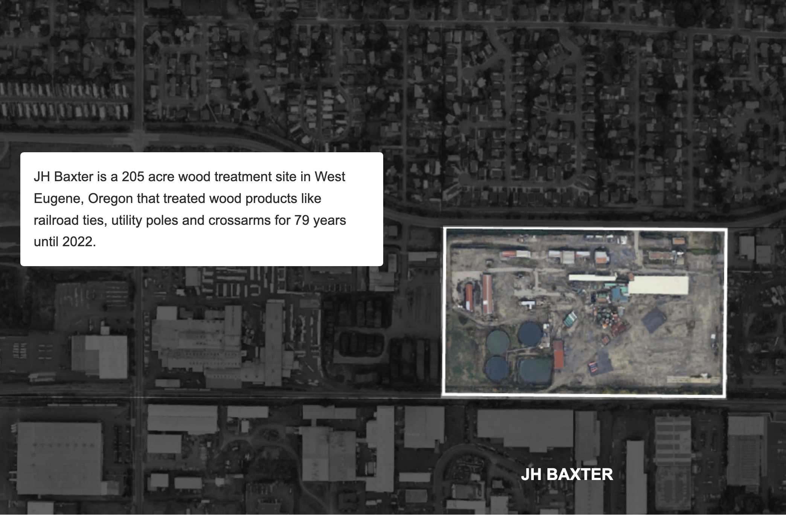

## What is this story about?

### This project examines a small community’s fight against a wood treatment facility that polluted groundwater and air, and released hazardous waste for decades in Eugene, Oregon.

### The reported story is published here:

**[Contaminated](https://ananyabchetia.github.io/contaminated/)**

### The project also investigates the national scope of contamination by analyzing how many public schools are located within one mile of a Superfund site. This repository contains the data, analysis and code used to investigate this.

## File structure

### scrollytelling_images

#### Contains assets used for the scrollytelling portion of the story built with Scrollama. Graphics were created using Google Earth imagery, Adobe Illustrator, and ai2html.

### all_datasets

### Stores all datasets used in the reporting and analysis for this project:

#### 1. FOIA

#### Public records of odor complaints from the wood treatment facility in Eugene, Oregon.

#### PDFs_of_superfunds

#### EPA PDFs listing proposed and active Superfund sites.

#### Superfund_list_csv

#### CSV files generated from the EPA Superfund PDFs.

#### These cleaned files can be used directly instead of scraping the PDFs.

#### public_school_dataset

#### Excel file containes public school locations across the United States and a derived CSV showing that nearly 1,800 public schools are located within one mile of a Superfund site.

## Workflow

### first_notebook.ipynb

#### Extracts active and proposed Superfund site data from a PDF and converts it into a clean CSV.

### second_notebook.ipynb

#### Identifies public schools located within one mile of Superfund sites using geospatial analysis.

### third_notebook.ipynb

#### Cleans FOIA-requested complaint data and formats it for a Datawrapper visualization.
